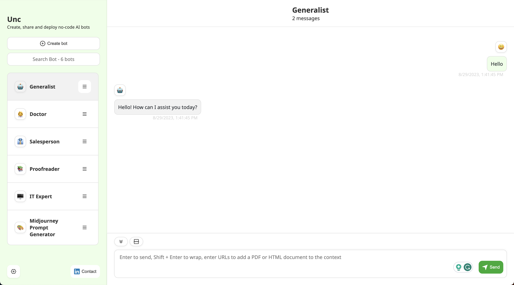

<br /><br />

<p align="center">
  
</p>

<h3 align="center"><b>LlamaIndex Chat</b></h3>
<p align="center"><b>Create chat bots that know your data</b></p>

<p>
      
</p>

Welcome to [LlamaIndex Chat](https://github.com/run-llama/chat-llamaindex). You can create and share LLM chatbots that know your data (PDF or text documents).

Getting started with LlamaIndex Chat is a breeze. Visit https://chat.llamaindex.ai - a hosted version of LlamaIndex Chat with no user authentication that provides an immediate start.

## 🚀 Features

LlamaIndex Chat is an example chatbot application for [LlamaIndexTS](https://github.com/run-llama/LlamaIndexTS).
You can:

- Create bots using prompt engineering and share them with other users.
- Modify the demo bots by using the UI or directly editing the [./app/bots/bot.data.ts](./app/bots/bot.data.ts) file.
- Integrate your data by uploading documents or generating new [data sources](#📀-data-sources).

## ⚡️ Quick start

### Local Development

Requirement: [NodeJS](https://nodejs.org) 18

- Clone the repository

```bash
git clone https://github.com/run-llama/chat-llamaindex
cd chat-llamaindex
```

- Prepare the project

```bash
pnpm install
pnpm run create-llama
```

> **Note**: The last step copies the chat UI component and file server route from the [create-llama](https://github.com/run-llama/create-llama) project, see [./create-llama.sh](./create-llama.sh).

- Set the environment variables

Edit environment variables in `.env.development.local`. Especially check your `OPENAI_API_KEY`.

- Run the dev server

```bash
pnpm dev
```

### 🐳 Docker

You can use Docker for development and deployment of LlamaIndex Chat.

#### Building the Docker Image

```bash
docker build -t chat-llamaindex .
```

#### Running in a Docker Container

```bash
docker run -p 3000:3000 --env-file .env.development.local chat-llamaindex
```

#### Docker Compose

For those preferring Docker Compose, we've included a docker-compose.yml file. To run using Docker Compose:

```bash
docker compose up
```

Go to http://localhost:3000 in your web browser.

**Note**: By default, the Docker Compose setup maps the `cache` and `datasources` directories from your host machine to the Docker container, ensuring data persistence and accessibility between container restarts.

### Vercel Deployment

Deploying to Vercel is simple; click the button below and follow the instructions:

[](https://vercel.com/new/clone?repository-url=https%3A%2F%2Fgithub.com%2Frun-llama%2Fchat-llamaindex&env=OPENAI_API_KEY)

If you're deploying to a [Vercel Hobby](https://vercel.com/docs/accounts/plans#hobby) account, [change the running time](./app/api/llm/route.ts#L196) to 10 seconds, as this is the limit for the free plan.

If you want to use the [sharing](#🔄-sharing) functionality, then you need to create a Vercel KV store and connect it to your project.
Just follow [this step from the quickstart](https://vercel.com/docs/storage/vercel-kv/quickstart#create-a-kv-database). No further configuration is necessary as the app automatically uses a connected KV store.

## 🔄 Sharing

LlamaIndex Chat supports the sharing of bots via URLs. Demo bots are read-only and can't be shared. But you can create new bots (or clone and modify a demo bot) and call the share functionality in the context menu. It will create a unique URL that you can share with others. Opening the URL, users can directly use the shared bot.

## 📀 Data Sources

The app is using a [`ChatEngine`](https://ts.llamaindex.ai/modules/chat_engine) for each bot with a [`VectorStoreIndex`](https://ts.llamaindex.ai/examples/vector_index) attached.
The `cache` folder in the root directory is used as [Storage](https://ts.llamaindex.ai/modules/storage) for each `VectorStoreIndex`.

Each subfolder in the `cache` folder contains the data for one `VectorStoreIndex`. To set which `VectorStoreIndex` is used for a bot, use the subfolder's name as `datasource` attribute in the [bot's data](./app/bots/bot.data.ts).

> **Note**: To use the changed bots, you have to clear your local storage. Otherwise, the old bots are still used. You can clear your local storage by opening the developer tools and running `localStorage.clear()` in the console and reloading the page.

### Generate Data Sources

To generate a new data source, create a new subfolder in the `datasources` directory and add the data files (e.g., PDFs).
Then, create the `VectorStoreIndex`` for the data source by running the following command:

```bash
pnpm run generate <datasource-name>
```

Where `<datasource-name>` is the name of the subfolder with your data files.

> **Note**: On Windows, use `pnpm run generate:win <datasource-name>` instead.

## 🙏 Thanks

Thanks go to @Yidadaa for his [ChatGPT-Next-Web](https://github.com/Yidadaa/ChatGPT-Next-Web) project, which was used as a starter template for this project.
