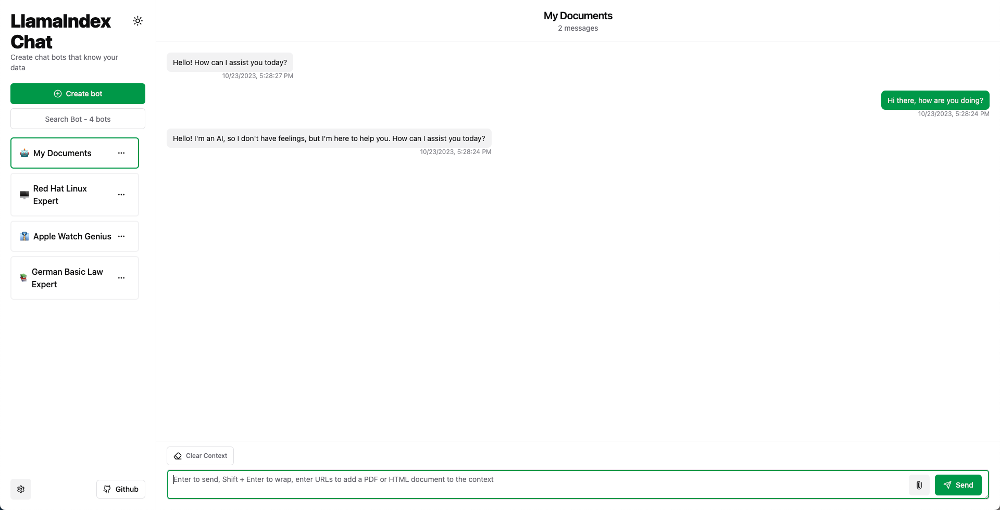

<br /><br />

<p align="center">
  
</p>

<h3 align="center"><b>Unc</b></h3>
<p align="center"><b>A privacy-first, enterprise-ready, open-source ChatGPT platform</b></p>

<p>
      
</p>

Welcome to [Unc](https://unc.de). A robust, scalable open-source platform built specifically for implementing privacy-first, enterprise-level ChatGPT.

Getting started with Unc is a breeze. Visit [unc.de](https://unc.de) - a hosted version of Unc with no user authentication, provides an immediate start.

## 🚀 Features

Unc is enterprise-ready, featuring:

- Self-hosted, can be installed in own cloud (private or public).
- Chat with your own HTML and PDF documents.
- Create bots using prompt engineering (no-code) and share them with other users. This avoids the repetition of frequently used prompts.
- Supports [Azure OpenAI from Microsoft](https://azure.microsoft.com/en-us/products/ai-services/openai-service), eliminating traffic to OpenAI.
- Privacy first; personal data is stored locally in the browser.

## 💼 Enterprise

A typical enterprise installation requires:

- Custom user authentication (e.g. Active Directory).
- Installation in a corporate cloud (AWS or Azure).
- Integration with data from third-party systems (e.g., Salesforce, ServiceNow, SAP, Oracle).

For enterprise support and installations, reach out to me on
[LinkedIn](https://linkedin.com/marcusschiesser).

## ⚡️ Quick start

### Use Gitpod

[](https://gitpod.io/#https://github.com/marcusschiesser/unc)

### Local Development

Requirement: [NodeJS](https://nodejs.org) 18

- Clone the repository

```bash
git clone https://github.com/marcusschiesser/unc
cd unc
```

- Run the dev server

```bash
yarn install
yarn dev
```

## ❤️ Community

Join the Unc community on [GitHub Discussions](https://github.com/marcusschiesser/unc/discussions). You can ask questions, share ideas, and showcase your projects.

Feedback is paramount. Please do share any suggestions, ideas, or bugs you encounter via [GitHub issues](https://github.com/marcusschiesser/unc/issues). Your insight is invaluable for enhancing future releases.
